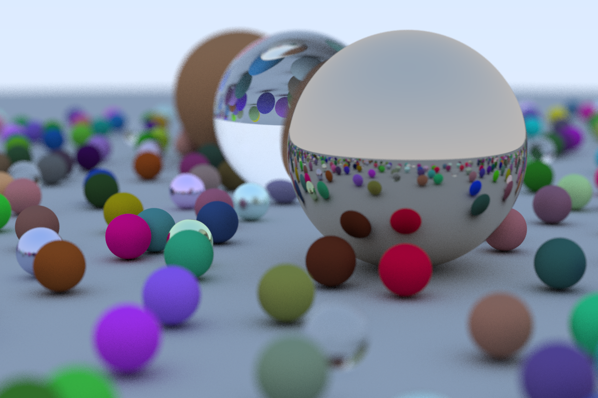

## Rust implementation of Peter Shirley's [Ray Tracing in One Weekend](http://in1weekend.blogspot.com/2016/01/ray-tracing-in-one-weekend.html)

Rough list of changes from the C++ version in the book:
* Vec\<Sphere\> instead of HitableList since this book only uses spheres (see [ray-tracing-the-next-week](https://gitlab.com/ninjani23/ray-tracing-the-next-week) for a better implementation).
* Option return types instead of bool return + pointer input
* Materials are in an enum

Run as "cargo run --release > image.ppm"

[ray-tracing-the-next-week](https://gitlab.com/ninjani23/ray-tracing-the-next-week) follows the second mini-book. It has more ray-tracing features and better Rust code. 
